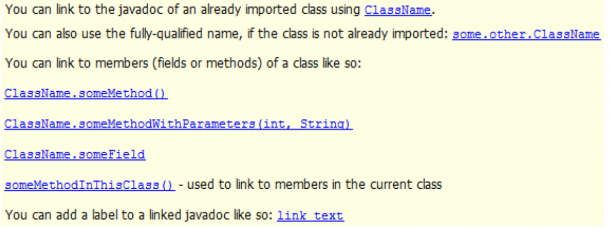
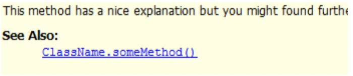
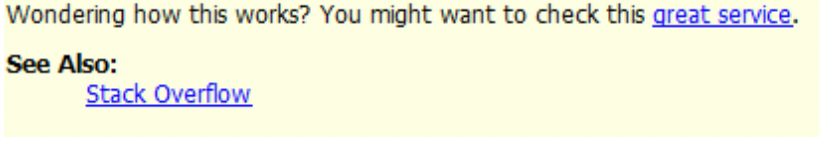

# Links
El enlace a otros Javadocs se realiza con la etiqueta `@link`:

```java
/**
 * You can link to the javadoc of an already imported class using {@link ClassName}.
 *
 * You can also use the fully-qualified name, if the class is not already imported:
 *  {@link some.other.ClassName}
 *
 * You can link to members (fields or methods) of a class like so:
 *  {@link ClassName#someMethod()}
 *  {@link ClassName#someMethodWithParameters(int, String)}
 *  {@link ClassName#someField}
 *  {@link #someMethodInThisClass()} - used to link to members in the current class
 *
 * You can add a label to a linked javadoc like so:
 *  {@link ClassName#someMethod() link text}
 */
```


Con la etiqueta @see puedes añadir elementos a la sección Ver también. Como @param o **@return**,
el lugar donde aparecen no es relevante. La especificación dice que deberías escribirlo después de **@return**.

```java
/**
 * This method has a nice explanation but you might found further
 * information at the bottom.
 *
 * @see ClassName#someMethod()
 */
```


Si quieres añadir **enlaces a recursos externos**,
solo tienes que usar la etiqueta HTML <a>. Puedes usarlo en línea en cualquier lugar o dentro de las
etiquetas @link y @see.

```java
/**
 * Wondering how this works? You might want
 * to check this <a href="http://stackoverflow.com/">great service</a>.
 *
 * @see <a href="http://stackoverflow.com/">Stack Overflow</a>
 */
```


