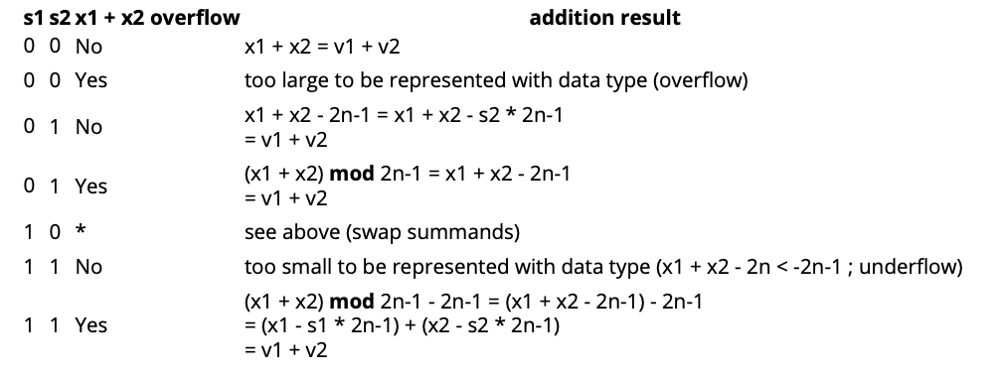

# Representación De Valor Negativo
Java y la mayoría de los otros lenguajes almacenan números integrales negativos en una representación llamada notación de complemento 2.

Para una representación binaria única de un tipo de datos usando `n` bits, los valores se codifican de esta manera:

Los bits `n-1` menos significativos almacenan un número integral positivo `x` en la representación integral.
El valor más significativo almacena un poco de valor vith `s`. El valor que repiten esos bits es

X - s * 2n-1

Es decir, si el bit más significativo es 1, 
entonces se resta un valor que es solo 1 mayor que el número que podría representar con los otros bits 
(`2n-2 + 2n-3 + ... + 21 + 20 = 2n-1 - 1`) permitiendo una representación binaria única para cada valor de
- 2n-1 (s = 1; x = 0) a 2n-1 - 1 (s = 0; x = 2n-1 - 1).


Esto también tiene el buen efecto secundario de que puedes añadir las representaciones binarias como si fueran números binarios positivos:

v1 = x1 - s1 * 2n-1 v2 = x2 - s2 * 2n-1

Tenga en cuenta que este hecho facilita la búsqueda de la representación binaria del inverso aditivo (es decir, el valor negativo):

Observe que agregar el complemento bit a nivel de bits al número da como resultado que todos los bits sean 1. Ahora añade 1 para hacer un desbordamiento de valor y obtendrás el elemento neutro 0 (todos los bits 0).

Así que el valor negativo de un número que se puede calcular usando (ignorando la posible promoción para int aquí)
```java
(~i) + 1
```
**Ejemplo**: tomando el valor negativo de 0 (`byte`):

El resultado de la negación de 0 es `11111111`. Añadir 1 da un valor de `100000000` (9 bits). Debido a que un `byte` 
solo puede almacenar 8 bits, el valor más a la izquierda se trunca y el resultado es 00000000

| Original     | Proceso             | Resultado              |
|--------------|---------------------|------------------------|
| 0 (00000000) | Negar               | -0 (11111111)          |
| 11111111     | Agregar 1 a binario | 100000000              |
| 100000000    | Truncate a 8        | 00000000 (-0 equals 0) |