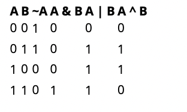

# Los Operadores Bitwise y lógicos (~, &, |, ^)
El lenguaje Java proporciona 4 operadores que realizan operaciones bit o lógicas en operandos enteros o booleanos.

* El operador de complemento (`~`) es un operador unario que realiza una inversión bit o lógica de los bits de un operando; véase JLS 15.15.5..
* El operador AND (`&`) es un operador binario que realiza un "y" bit o lógico de dos operandos; véase JLS 15.22.2.
* El operador OR (`|`) es un operador binario que realiza un "inclusivo o" bit o lógico de dos operandos; véase JLS 15.22.2..
* El operador XOR (`^`) es un operador binario que realiza un "exclusivo o" por bit o lógico de dos operandos; véase JLS 15.22.2..

Las operaciones lógicas realizadas por estos operadores cuando los operandos son booleanos se pueden resumir de la siguiente manera:


Tenga en cuenta que para los operandos enteros, la tabla anterior describe lo que sucede con los bits individuales.
Los operadores en realidad operan en los 32 o 64 bits del operando o operandos en paralelo.

### Tipos de operandos y tipos de resultados.

Las conversiones aritméticas habituales se aplican cuando los operandos son enteros.
Casos de uso comunes para los operadores bitwise

El operador `~` se utiliza para revertir un valor booleano o cambiar todos los bits de un operando entero.

El operador `&` se utiliza para "enmascarar" algunos de los bits de un operando entero. Por ejemplo:
```java
int word = 0b00101010;
int mask = 0b00000011;          // Máscara para enmascarar todo, pero la parte inferior
                                // Dos bits de word
int lowBits = word & mask;      // -> 0b00000010 
int highBits = word & ~mask;    // -> 0b00101000
```
El operador `|` se utiliza para combinar los valores de verdad de dos operandos. Por ejemplo:
```java
int word2 = 0b01011111;
// Combina los 2 bits inferiores de word1 con los 30 bits superiores de word2
int combined = (word & mask) | (word2 & ~mask);  // -> 0b01011110
```
El operador `^` se utiliza para alternar o "flipping" bits:
```java
int word3 = 0b00101010;
int word4 = word3 ^ mask; // -> 0b00101001
```
Para obtener más ejemplos del uso de los operadores bitwise, consulte Manipulación de bits