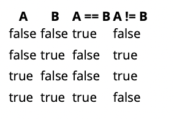

# Los operadores de igualdad (==, !=)
¡El `==` y `!=` los operadores son operadores binarios que se evalúan como `true` o `false` dependiendo de si los operandos son iguales. 
El operador `==` da `true` si los operandos son iguales y falso de lo contrario.
El `!=` el operador da `false` si los operandos son iguales y `true` de lo contrario.

Estos operadores se pueden utilizar operandos con tipos primitivos y de referencia,
pero el comportamiento es significativamente diferente.
Según el JLS, en realidad hay tres conjuntos distintos de estos operadores:

* El booleano `==` y `!=` operadores.
* El numérico `==` y `!=` operadores.
* La referencia `==` y `!=` operadores.

Sin embargo, en todos los casos, el tipo de resultado del `==` y `!=` operadores es `boolean`.

### El numérico `==` y `!=` operadores

Cuando uno (o ambos) de los operandos de un `==` o `!=` el operador es un tipo numérico primitivo 
    (`byte`, `short`, `char`, `int`, `long`, `float` o `double`), el operador es una comparación numérica.
El segundo operando debe ser un tipo numérico primitivo o un tipo numérico en caja.

El comportamiento de otros operadores numéricos es el siguiente:

1. Si uno de los operandos es un tipo en caja, se desempaqueta.

2. Si cualquiera de los operandos ahora es un `byte`, `short` o `char`, se promueve a un `int`.

3. Si los tipos de los operandos no son los mismos, entonces el operando con el tipo "más pequeño" se promueve al
Tipo "más grande".

4. La comparación se lleva a cabo de la siguiente manera:

   * Si los operandos promovidos son `int` o `long`, los valores se prueban para ver si son idénticos.
   * Si los operandos promovidos son `float` o `double`, entonces:
     * Las dos versiones de cero (+0.0 y -0.0) se tratan como iguales
     * Un valor de NaN se trata como no igual a nada, y
     * Otros valores son iguales si sus representaciones IEEE 754 son idénticas.

Nota: debes tener cuidado al usar `==` y `!=` para comparar los valores de coma flotante.

### El booleano `==` y `!=` operadores

Si ambos operandos son `boolean`, o uno es `boolean` y el otro es `Boolean`,
estos operadores el booleano == y ! = operadores. El comportamiento es el siguiente:

1. Si uno de los operandos es `Boolean`, se desempaqueta.

2. Los operandos sin caja se prueban y el resultado booleano se calcula de acuerdo con la siguiente tabla de verdad




Hay dos "caídas" que hacen que sea recomendable usar == y ! = con moderación con los valores de la verdad:

* Si usas `==` o `!=` para comparar dos objetos `Boolean`, luego se utilizan los operadores de referencia. Esto puede dar un Resultado inesperado; ver Pitfall: usando `==` para comparar objetos de envoltorios primitivos como Integer
* El operador `==` se puede escribir fácilmente mal como `=`. Para la mayoría de los tipos de operandos, este error conduce a un error de compilación. Sin embargo, para los operandos `boolean` y `Boolean`, el error conduce a un comportamiento incorrecto en tiempo de ejecución; ver Pitfall - Uso de '`==`' para probar un booleano

### La referencia `==` y `!=` operadores

Si ambos operandos son referencias de objetos, el `==` y `!=` los operadores prueban si los dos operandos **se refieren al mismo objeto**.
Esto a menudo no es lo que quieres. Para probar si dos objetos son iguales por valor, se debe usar el método `.equals()` en su lugar.
```java
String s1 = "We are equal";
String s2 = new String("We are equal");

s1.equals(s2); // true
// WARNING - No uses == or != Con valores String 
s1 == s2; // false
```
