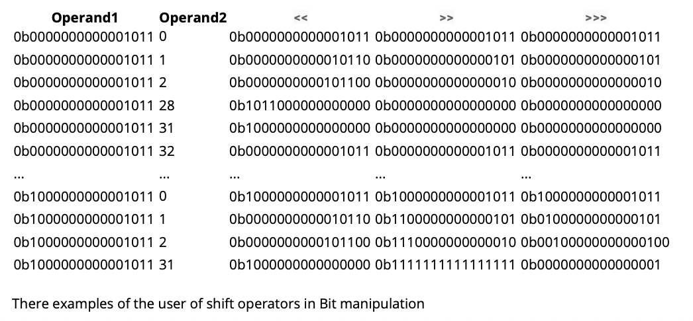

# Los operadores de Shift (<<, >> y >>>)

El lenguaje Java proporciona tres operadores para realizar cambios en bits en valores enteros de 32 y 64 bits.
Estos Todos son operadores binarios con el primer operando siendo el valor a cambiar, y el segundo operando diciendo qué tan lejos es cambiar.

* El operador << o desplazamiento izquierdo cambia el valor dado por el primer operando hacia la izquierda en el número de posiciones de bits dadas por el segundo operando. Las posiciones vacías en el extremo derecho están llenas de ceros.
* El operador '>>' o cambio aritmético cambia el valor dado por el primer operando hacia la derecha por el número de posiciones de bits dadas por el segundo operando. Las posiciones vacías en el extremo izquierdo se llenan copiando el bit más a la izquierda. Este proceso se conoce como extensión de firma.
* El operador '>>>' o cambio lógico a la derecha desplaza el valor dado por el primer operando hacia la derecha por el número de posiciones de bits dadas por el segundo operando. Las posiciones vacías en el extremo izquierdo están llenas de ceros.

Notas:

1. Estos operadores requieren un valor int o largo como el primer operando, y producen un valor con el mismo tipo que el primer operando. (Tendrá que usar un tipo de letra explícito al asignar el resultado de un cambio a una variable de byte, corta o de carácter).

2. Si utiliza un operador de cambio con un primer operando que es un byte, char o corto, se promueve a un int y la operación produce un int.)

3. El segundo operando se reduce modulo el número de bits de la operación para dar la cantidad del desplazamiento. Para obtener más información sobre el concepto matemático mod, consulte los ejemplos de Modulus.

4. Los bits que se desplazan del extremo izquierdo o derecho por la operación se descartan. (Java no proporciona un operador primitivo de "rotación").

5. El operador de desplazamiento aritmético es equivalente dividiendo un número (el complemento de dos) por una potencia de 2.

6. El operador de turno izquierdo es equivalente multiplicando un número (el complemento de dos) por una potencia de 2.

La siguiente tabla te ayudará a ver los efectos de los tres operadores de turno.
(Los números se han expresado en notación binaria para ayudar a la visualización).

